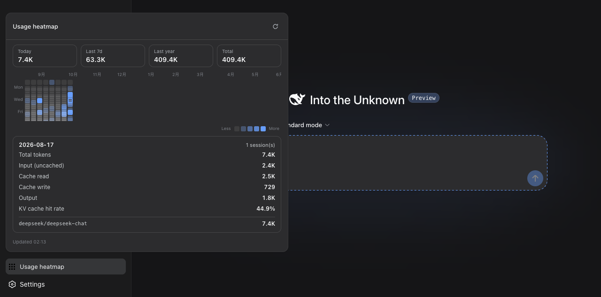

# dsh-scope

[](https://www.dsh.so/artifact/dsh-scope/)
[](LICENSE)

**English** · [简体中文](README.zh.md)

**Context visibility for [DeepSeek Harness](https://github.com/deepseek-ai/deepseek-harness) (`dsh`)** — a Codex-style `/context` lens for every session, plus a GitHub-style usage heatmap for your whole history.

Two UI contributions, one plugin:

1. **Context Lens** (session header) — live context-window occupancy with a segmented system / tools / messages composition bar, per-bucket session totals, and KV-cache hit rate. All data flows through the official `token-meter` session projections via `useProjection` — no RPC, no custom wire protocol.
2. **Usage Heatmap** (sidebar footer) — a GitHub-contribution-graph-style rolling 53-week token-usage grid. Click any day for the four token buckets, cache hit rate, session count, and per-model ranking. Fed by this plugin's own loopback-only aggregation endpoint.

## Screenshots



## Why

DeepSeek Harness treats wording and context as first-class engineering concerns, yet the stock Web UI shows no context occupancy and no usage history. `dsh-scope` fills both gaps the harness-native way: reading the projections the platform already computes, styling with the platform's design tokens (`--dsw-alias-*`), and mounting through the platform's slot registry — light/dark themes both correct with zero media queries.

## Install

Requires `dsh` ≥ `0.1.0-rc.6` on your PATH.

```sh
git clone https://github.com/helloxkk/dsh-scope.git
cd dsh-scope
npm install && npm run build
node scripts/install.mjs web        # or: node scripts/install.mjs <profile>
dsh web                             # restart dsh to load the plugin
```

The installer copies `lib/`, `cordis.patch.yml`, and `package.json` into the profile's `node_modules` and appends the bundle insert to the profile's `cordis.patch.yml` (idempotent — safe to re-run after every rebuild).

### Uninstall

```sh
rm -rf ~/.dsh/profiles/web/node_modules/dsh-scope
# then remove the "# dsh-scope" block from ~/.dsh/profiles/web/cordis.patch.yml
rm -f ~/.dsh/storages/dsh-scope-cache.json   # optional: drop the fold cache
```

## How it works

**Client half** (`lib/client.js`, loaded via the package's `dsh.client` declaration):

- `conversation.session.header.actions` (order 30, after the job list) renders the lens trigger: an occupancy ring with the live percentage. The popover reads three official projections — `tokenUsage` (four buckets accumulated over the whole durable log), `contextPressure` (input-side window pressure + the route's context window), and `contextBreakdown` (heuristic system/tools/message composition of the next request).
- `sidebar.footer.action` renders the heatmap trigger (label when the sidebar is wide, icon on the rail). The popover fetches `GET /api/dsh-scope/days` same-origin.

**Host half** (`lib/index.js`): one read-only, loopback-fenced endpoint (`/api/dsh-scope/days`). Aggregation is incremental: per-session fold state is cached in memory and persisted to `~/.dsh/storages/dsh-scope-cache.json`; each request folds only events added since the last fold. Live sessions fold their in-memory tail; persisted sessions use the storage backend's opaque revision and `readFrom(id, fromSeq)`, with contiguity checks and a full refold on log rewrites. Steady-state cost stays O(new events) no matter how large the logs grow.

Fold semantics mirror `dsh-token-meter`'s `tokenUsage` projection: a usage sample rides an `assistant/chunk` (`data.chunk.type === "usage"`) or `assistant/message` (`data.usage`); a repeated sample for the same (turn, step) replaces the earlier value instead of double counting, re-attributed to the later event's day and model. Model attribution follows `assistant/message`'s `data.message.source`, falling back to the last `request/header` config.

Nothing is sent anywhere: the endpoint refuses non-loopback callers and non-GET methods before any work, and no provider credentials are read.

## Development

```sh
npm run build                          # tsdown: host ESM + browser ModuleLoader bundle
node scripts/fixture-session.mjs       # optional: write a demo session log with usage events
node scripts/install.mjs web && dsh web
```

## Compatibility

Built and verified against `dsh` `0.1.0-rc.6` (`@deepseek-ai/dsh-base` / `dsh-web-app` bundles). The harness is in developer preview and iterates quickly — expect compatibility-breaking changes.

## License

MIT
