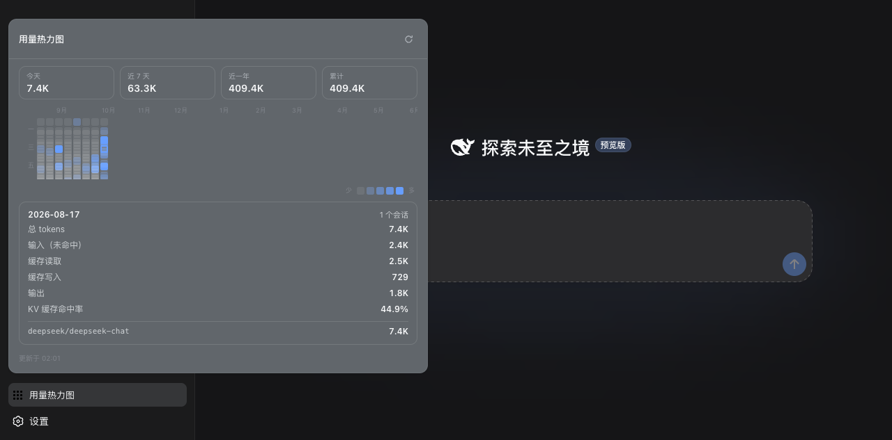

# dsh-context-lens

[English](README.md) · **简体中文**

**[DeepSeek Harness](https://github.com/deepseek-ai/deepseek-harness)（dsh）的上下文可视化插件** —— 每个会话的 Codex 式 `/context` 透镜 + 全历史的 GitHub 式用量热力图。

一个插件，两处 UI：

1. **Context Lens**（会话头部）—— 实时 context 窗口占用率（system / tools / messages 分段构成条）、四桶会话累计、KV 缓存命中率。数据全部来自官方 `token-meter` 会话投影（`useProjection`）—— 无 RPC、无自定义协议。
2. **用量热力图**（侧边栏底部）—— GitHub 贡献图风格的滚动 53 周 token 用量网格。点击任意日期查看四桶明细、缓存命中率、会话数、模型排行。数据来自本插件自己的回环聚合端点。

## 截图



## 为什么做

DeepSeek Harness 把措辞和上下文当一等工程对象，但自带 Web UI 既不显示 context 占用也没有用量历史。`dsh-context-lens` 按 harness 原生方式补上这两个缺口：读平台已经算好的投影、用平台的设计 token（`--dsw-alias-*`）、走平台的 slot 注册体系 —— 明暗主题零媒体查询都正确。

## 安装

需要 `dsh` ≥ `0.1.0-rc.6` 在 PATH 上。

```sh
git clone https://github.com/helloxkk/dsh-context-lens.git
cd dsh-context-lens
npm install && npm run build
node scripts/install.mjs web        # 或: node scripts/install.mjs <profile>
dsh web                             # 重启 dsh 加载插件
```

安装脚本把 `lib/`、`cordis.patch.yml`、`package.json` 复制进 profile 的 `node_modules`，并向 profile 的 `cordis.patch.yml` 追加 bundle insert（幂等，每次 rebuild 后可重复执行）。

### 卸载

```sh
rm -rf ~/.dsh/profiles/web/node_modules/dsh-context-lens
# 再从 ~/.dsh/profiles/web/cordis.patch.yml 删掉 "# dsh-context-lens" 块
rm -f ~/.dsh/storages/context-lens-cache.json   # 可选：清掉 fold 缓存
```

## 工作原理

**浏览器半**（`lib/client.js`，通过 package.json 的 `dsh.client` 声明被发现）：

- `conversation.session.header.actions`（order 30，排在任务列表之后）渲染透镜触发器：占用率圆环 + 实时百分比。弹出面板读取三个官方投影 —— `tokenUsage`（整个持久日志累计的四桶）、`contextPressure`（输入侧窗口压力 + 路由的 context window）、`contextBreakdown`（下一次请求的 system/tools/message 启发式构成）。
- `sidebar.footer.action` 渲染热力图触发器（侧栏展开显示文字，收起显示图标）。弹出面板同源 fetch `GET /api/context-lens/days`。

**宿主半**（`lib/index.js`）：一个只读、仅回环的端点。聚合是增量的：每会话 fold 状态缓存在内存并持久化到 `~/.dsh/storages/context-lens-cache.json`；每次请求只 fold 上次之后新增的事件。活跃会话 fold 内存尾部；持久会话用存储后端的不透明 revision 和 `readFrom(id, fromSeq)`，带连续性检查，日志被重写则全量重 fold。稳态成本 O(新增事件)，日志再大也不变慢。

Fold 语义对齐 `dsh-token-meter` 的 `tokenUsage` 投影：usage 样本挂在 `assistant/chunk`（`data.chunk.type === "usage"`）或 `assistant/message`（`data.usage`）上；同一 (turn, step) 的重复样本替换旧值而非重复计数，并重新归因到后一事件所在的日期与模型。模型归因跟随 `assistant/message` 的 `data.message.source`，回退到最近的 `request/header` 配置。

不外发任何数据：端点在任何处理前拒绝非回环调用者和非 GET 方法，不读取任何 provider 凭据。

## 开发

```sh
npm run build                          # tsdown: 宿主 ESM + 浏览器 ModuleLoader bundle
node scripts/fixture-session.mjs       # 可选: 写一条带 usage 事件的演示会话日志
node scripts/install.mjs web && dsh web
```

## 兼容性

基于 `dsh` `0.1.0-rc.6`（`@deepseek-ai/dsh-base` / `dsh-web-app` bundle）构建并验证。harness 处于开发者预览阶段迭代很快 —— 预期会有破坏性变更。

## 许可

MIT
